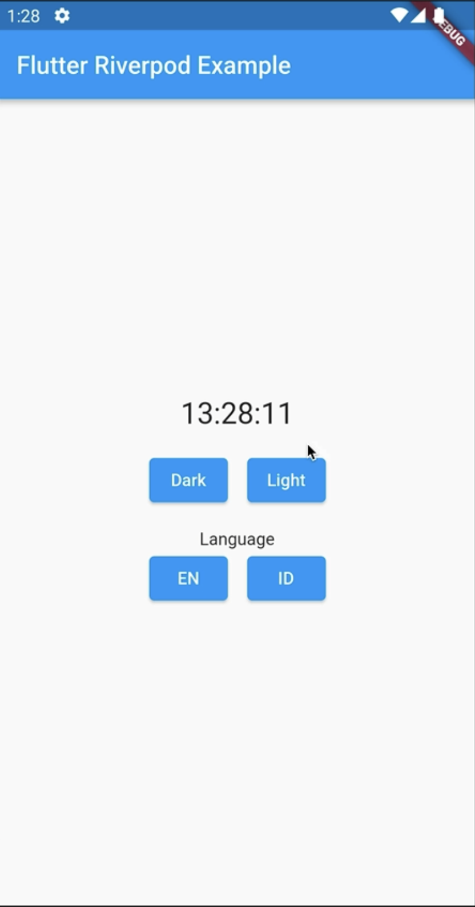
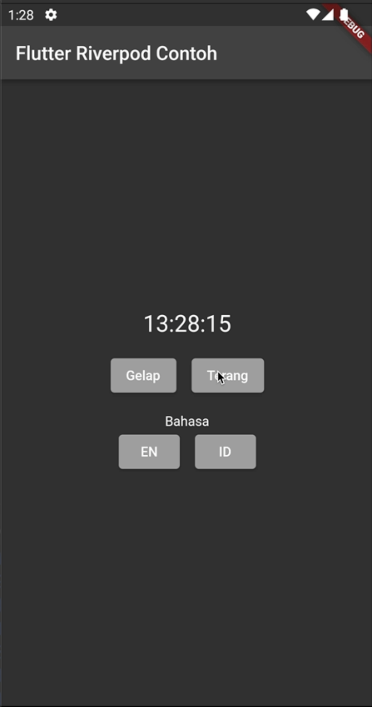

# Learning Flutter Riverpod 2.0 for Flutter ID Talk

Flutter riverpod with case dark mode provider, and change language provider

## Getting Started

- flutter pub get -v
- flutter gen-l10n

## Youtube Link

https://youtu.be/BTHNYM4f_js

## ScreenShot

| light en         | dark id           |
|--------------|----------------|
|  |       |

## Playlist Flutter Intensive Club

https://www.youtube.com/playlist?list=PLQvQbJRJpIZ67MrVzPDOYtAs7wmFjmFUI (https://www.youtube.com/playlist?list=PLQvQbJRJpIZ67MrVzPDOYtAs7wmFjmFUI)

## Roadmap Learing Flutter by Flutter Intensive Club (FIC)

https://miro.com/app/board/uXjVPKAz1i4=/?share_link_id=218530192751 (https://miro.com/app/board/uXjVPKAz1i4=/?share_link_id=218530192751)

## Contact:
# Consultation Flutter and Endorse https://t.me/bahri_bhe
# Github: https://github.com/bahrie127
# Linkedin: https://linkedin.com/in/bahrie
# Roadmap Flutter: https://youtu.be/e2zMJqDBmoY
# Medium: https://medium.com/@bahri